# Beerz

## Deployed Site:

https://beerz.netlify.app/verification

### **Github Frontend Repo**

https://github.com/Btallan/CA-T3A2-B-Beerz-Front

### **Github API Repo**

https://github.com/Btallan/CA-T3A2-B-Beerz-Api

## Description of Project

### **Purpose**

The website in creation will be for a beer distillery. Common functions such as; a viewable line of products to learn about new beers, the ability to order products, and the ability to book a tour to taste and learn about averted beers, and a reviews system, will be implemented.

The reviews process for the products at hand, will help other enthusiasts select a new beverage, or help newcomers understand what they would like. An events feature will allow the distillery to host tours and tastings, to allow newcomers and beer enthusiasts to see the process required to create their brews, such as; where and how the beers are made, how they’re stored and what machines are used in production, as well as a tastings session to try before they buy.

Overall, the website is a medium for enthusiasts and newcomers to enjoy the beer distillery process and inventory alike.

### **Functionality and Features**

On the website, features and functionality will include:

1. The ability to check the users age, to ensure they are over the age of 18+.
   - The website will need users to confirm they are over the age of 18, as minors are not allowed to view or buy alcoholic products.
2. Presentation of the lines of beers that the distillery produce;
   - Images,
   - Name,
   - Production Date,
   - Description,
   - Flavour tags,
3. Reviews and comments,
   - Allowing reviews will be very beneficial for new / returning customers to understand more about the drink they will potentially be purchasing or trying.
4. User profiles,
   - A user's account will be used for their booking and purchasing information. Their flavour tags can also be used as direct marketing for when a new line is released which fits their profile.
5. Event management,
   - The distillery will be able to take bookings for their tours, but will require guests to create an account.
6. Purchase stock,
   - Users will be required to create an account before purchasing. Once this has been achieved they will be able to purchase stock through the website.

### **Target Audience**

The current focus of the website is for a craft beer distillery, as such the common target audience will be beer drinkers and beer enthusiasts to try out the multitude of potential beverages. The website will allow tours to be booked therefore a secondary target would be for tour attendees, tourists looking for a day activity. Reviewers would consist of potential media influencers, forum active influencers and again beer enthusiasts.

Identified audiences:

- Beer drinkers,
- Tour attendees,
- Gift purchsers,
- Reviewers.

### **Tech Stack**

| Section   | Dependencies                         |
| --------- | ------------------------------------ |
| Front End | React.js                             |
| Back End  | Ruby on Rails PostgreSQL          |
| Externals | Netlify Heroku                    |
| APS       | Stripe Google Calendar API AWS |

1. React.js  
   React.js, more commonly known as React, is a free, open-source JavaScript library. It works best to build user interfaces by combining sections of code (components) into full websites.  
   [React.js ref](https://codeinstitute.net/global/blog/what-is-react-js/)

2. Ruby on Rails  
   Rails is a development tool which gives web developers a framework, providing structure for all the code they write, by means of Models, Views and controller, which are also known as an MVC archectirue. Rails helps developers build websites and applications, due to it abstracting and simplifing common repetitive tasks. 
   [Ruby on Rails ref](https://bitzesty.com/2014/03/03/ruby-on-rails-what-it-is-and-why-we-use-it-for-web-applications/)
3. Express.js
   Express is a node js web application framework that provides broad features for building web and mobile applications. It is used to build a single page, multipage, and hybrid web application. It's a layer built on the top of the Node js that helps manage servers and routes.  
   [Express.js ref](https://www.simplilearn.com/tutorials/nodejs-tutorial/what-is-express-js)
4. SQL  
   Structured Query Language (SQL) is a standardised programming language that is used to manage relational databases and perform various operations on the data in them. It is further used for modifying database tables and index structures by; adding, updating and deleting rows of data and retrieving subsets of information from within RDM systems.  
   [SQL ref](https://www.techtarget.com/searchdatamanagement/definition/SQL)
5. Netlify  
   Netlify is a web hosting infrastructure and automation technology service that is used to quickly deploy apps and web-services.  
   [Netlify ref](https://www.netlify.com/)
6. Heroku  
   Heroku is a container-based cloud platform as a service (PaaS). This is used to deploy, manage, and scale modern apps.  
   [Heroku ref](https://www.heroku.com/about)
7. Stripe  
   Stripe is a payment service provider that businesses can use to accept dozens of payment methods; from credit cards, to buy now pay later services. This is used within web-development for an easy implementation of paid services, allowing operators to process payments through a third-party.  
   [Stripe ref](https://www.nerdwallet.com/article/small-business/what-is-stripe)
8. Google Calendar API  
   Googles Calendar API allows developers to add calender functionality and data into their apps using a REST interface, or what will use, a client library which is used via Java, Python, PHP, JS and more.  
   [Google Calendar API](https://www.nylas.com/blog/integrate-google-calendar-api)
9. AWS (Amazon Web Services)
   AWS is a mixture of infrastructure as service (IaaS, platform as a service (PaaS) and packaged software as service (SaaS). Used for scalability, cost-effectiveness cloud computing solutions. This would involve things like on-demand operations, database storage, content deliberation etc. This reduces the need for developers and project managers to create and manage their own personal servers.  
   [AWS ref](https://www.simplilearn.com/tutorials/aws-tutorial/what-is-aws)

## **User Stories**

- Personas:
  - Beer drinker and enthusiasts,
  - Purchasers,
  - Tour attendee.

| User Stories                                                                                                                                                                                       |
| -------------------------------------------------------------------------------------------------------------------------------------------------------------------------------------------------- |
| As a customer, I want to look at the website, so that I can see their line of products.                                                                                                            |
| As a customer, I want to see their line of products, so that I can see what interests me.                                                                                                          |
| As a site visitor, I want to read more about the brewery, so that I can understand what they do, and how they got there.                                                                           |
| As a site visitor, I want the ability to contact the company, so that I can talk to a person about any questions or problems that I may have.                                                      |
| As a company, I want to verify the age of persons visiting the site, so that I can ensure minors do not access it.                                                                                 |
| As a customer I want the ability to make and account, so that I can add my details and drink preferences.                                                                                          |
| As a customer, I want the ability to log into my account, so that I can see my current/previous orders, update my details and change my flavour profiles.                                          |
| As a customer, I want the ability to sign out of my account, so that I don’t leave it open when my children use the computer.                                                                      |
| As a customer I want to see the overall rating, so that I can see what people rate it without going through all of the reviews.                                                                    |
| As a customer I also want the ability to see others reviews, to see their opinions.                                                                                                                |
| As a customer, I want the ability to also leave my own reviews, so that I can leave my feedback and potentially help others in the future.                                                         |
| As a customer on the products page, I want to see a description of the product, so that I can know more about it, such as; the flavour, and what type it is, to see whether I want to purchase it. |
| As a beer drinker, I want to be able to find a beer I’ll enjoy, so that I can purchase it and have it shipped to me, based upon the address supplied in my profile or supplied at checkout.        |
| As a beer drinker, I want to book tasting tours, so that I can experience them in person.                                                                                                          |
| As a tour attendee, I want to see all of the available tours that are coming up, so that I can choose at my discretion, what tour I want to attend.                                                |
| As a tour attendee, once I have decided upon a time, I want to book into that tour, so that I can reserve my place, as well as nominate how many other attendees will also be coming.              |
| As a reviewer, I want to be able to leave reviews and comments, so that I can leave my comments and description on my thoughts of the product.                                                     |

## **Application Architecture Diagram**

## **Data Flow Diagram**

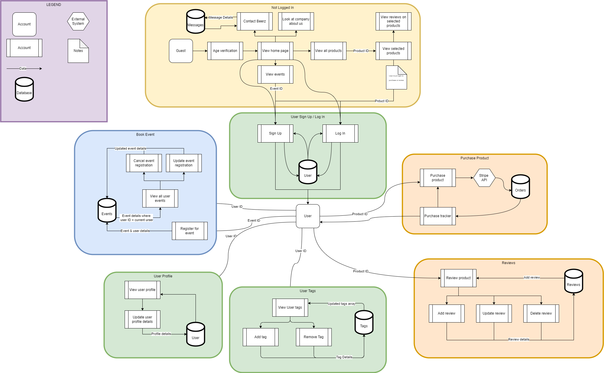

### **Data Flow Diagram: User not logged in**

This section of the DFD is based upon the premise that the user will not be logged in. The features will be available to all user types, whether or not they are logged in.  
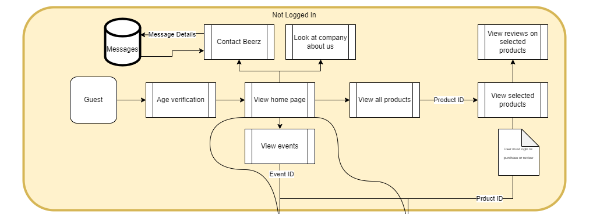

### **Data Flow Diagram: User events management**

Users will access the event data flow either by; registering for an event or viewing their current events. Guests can view currently listed events, but will only be able to register if they create or have an account. Users will be able to change or cancel their reservation through their user profile.  
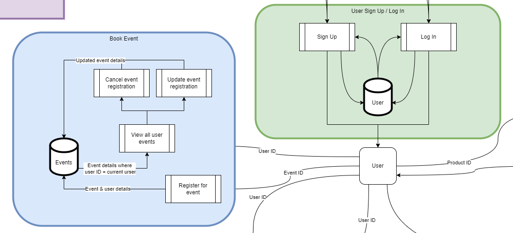

### **Data Flow Diagram: User product purchase and review**

Guests will be able to see the product line and selected products. Only user who are logged in will be able to purchase or review products.  

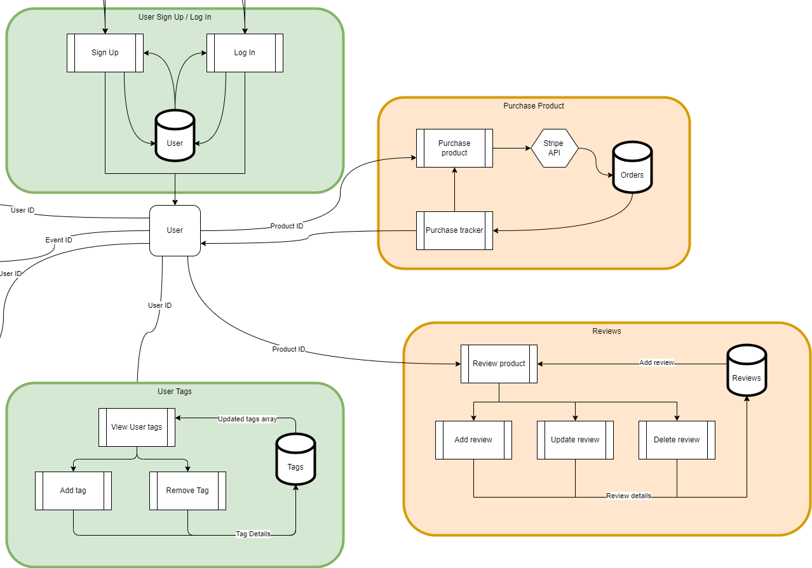

### **Data Flow Diagram: User profile and tags**

Users will have their own profiles, where they can upload and update their own credentials.  
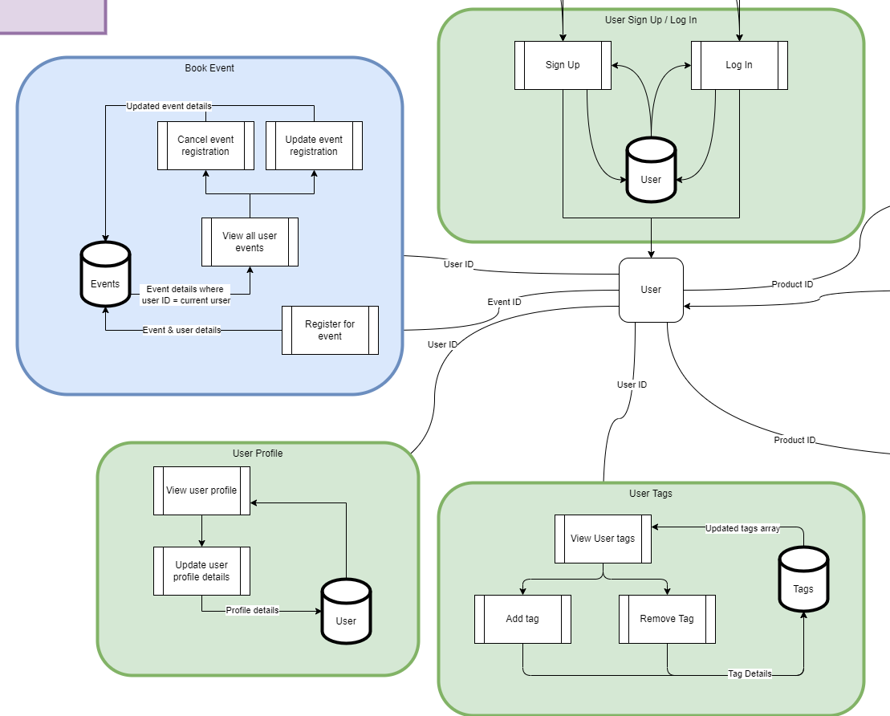

## **Wireframes**

### Dimensions

| Screen  | Device             | Size       |
| ------- | ------------------ | ---------- |
| Desktop | Desktop            | 1440w x Xh |
| Tablet  | iPad Pro 11"       | 834w x Xh  |
| Mobile  | iPhone 13 / 13 Pro | 390w x Xh  |

[LINK TO PROJECT](https://www.figma.com/file/8ztrznS2mdwR2dAAQ2ywgt/CA---T3A2-A---Full-Stack-App---Wireframes?node-id=3%3A4)

#### **Wireframe: Age verification**

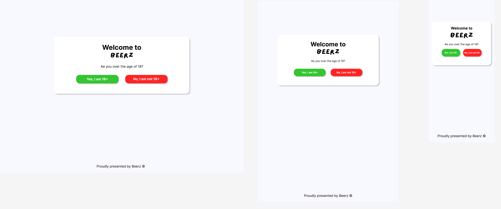

#### **Wireframe: Home page**

#### **Wireframe: Product page**

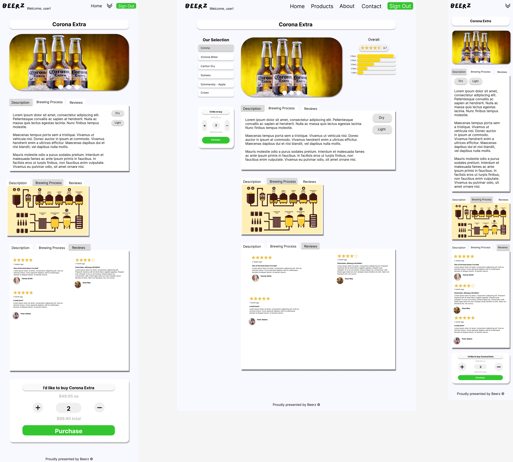

#### **Wireframe: Sign Up**

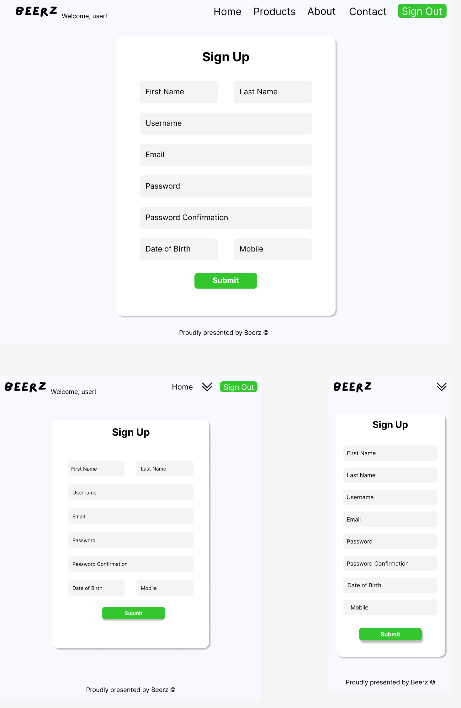

#### **Wireframe: Log In**

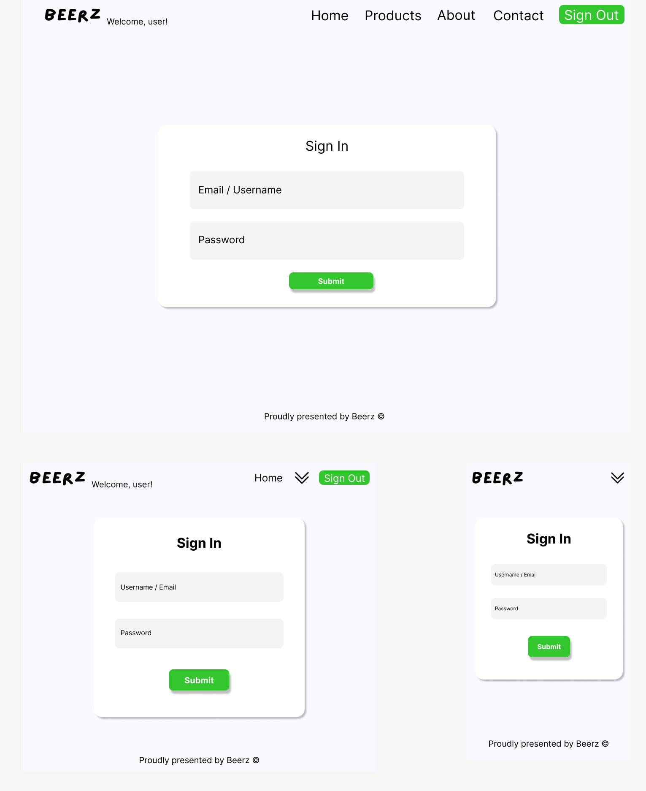

#### **Wireframe: User profiles**

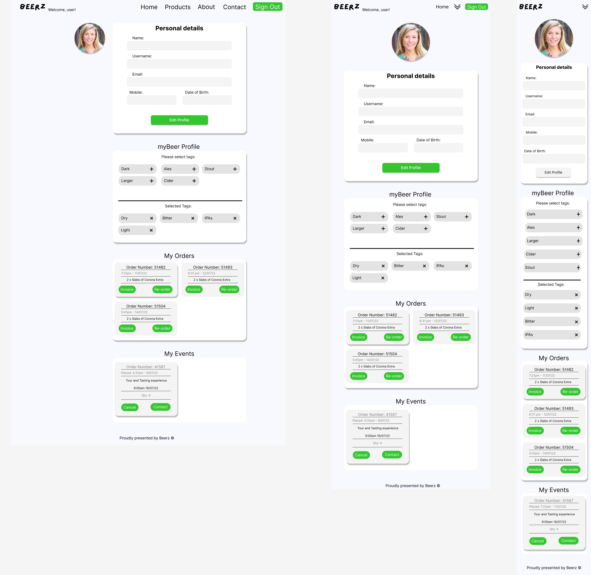

## **Trello Board**

The Kanban template was current selection with indication of priorities seen below from low-importance -> Must do -> Urgent - There is then also a “potential” listing and Front/Back end verification. There are set checklists and due date representations within each card allowing for a proper workflow and will be ticked / marked off when done. There are To-Do and Doing lists to clearly devise the work that is currently being and needed to be done.

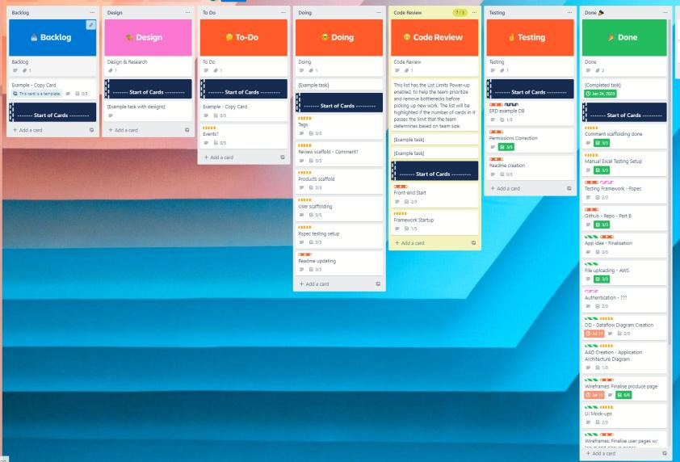
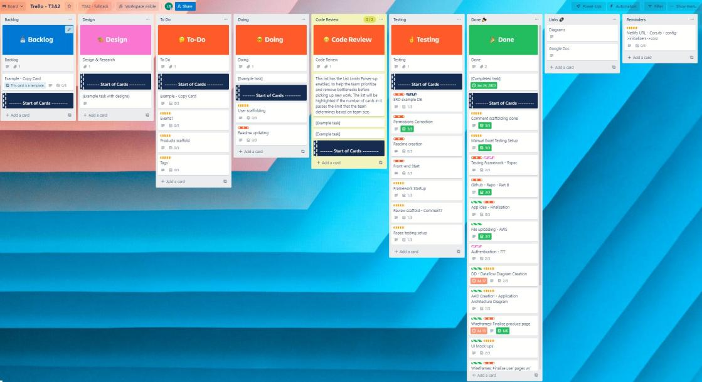
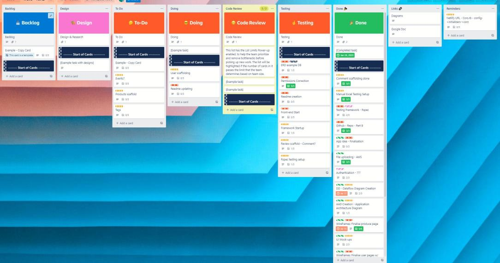
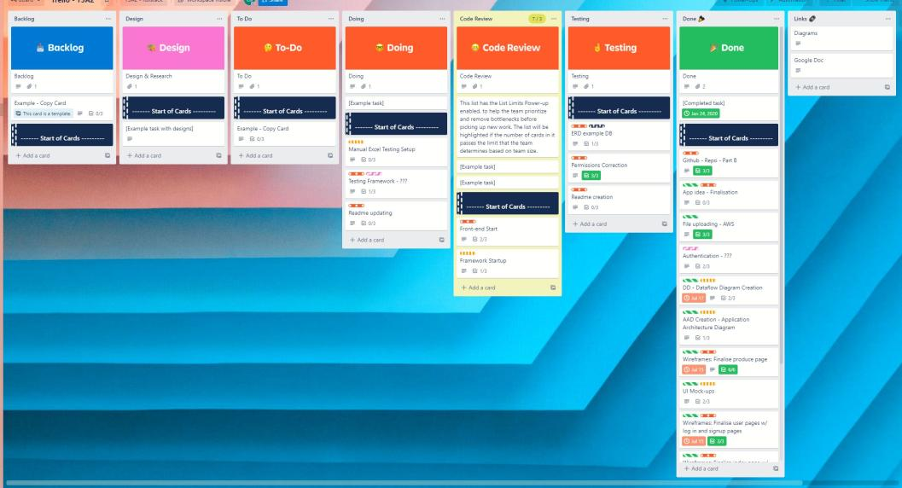

## **Manual Testing**

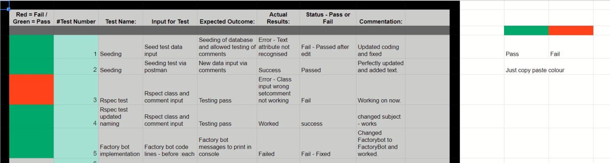

Images used have been sourced from unsplash.com

- Hero Image:

- Beer Being Poured in About Us credit to:
  Photo by <a href="https://unsplash.com/@barncreative?utm_source=unsplash&utm_medium=referral&utm_content=creditCopyText">Fábio Alves</a> on <a href="https://unsplash.com/?utm_source=unsplash&utm_medium=referral&utm_content=creditCopyText">Unsplash</a>
